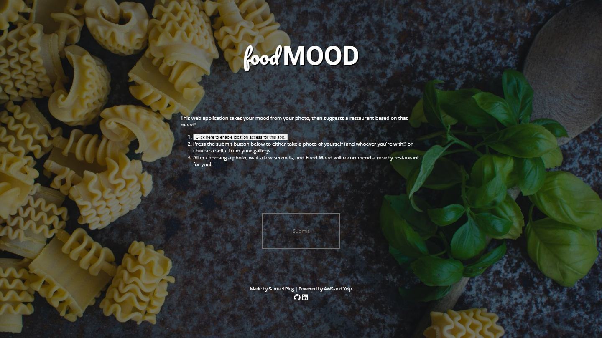

# Food Mood

Food Mood is a web application that detects your mood from your selfie to suggest a nearby restaurant!

### How it works:

After submitting an image, the image is sent to Amazon Rekognition, which determines your emotion from the photo. Then, using Yelp's Fusion API, a restaurant is suggested to you based on the emotion!

#### Technologies I used and learned about throughout this project:
React.js, HTML, CSS, JavaScript, Express.js, Node.js, Website Hosting/Deployment, Continuous Integration/Deployment, Nginx, AWS EC2, AWS CodePipeline, AWS CodeDeploy, AWS Lambda, AWS API Gateway, AWS S3, & AWS Amplify.

## Story:

I first started this project as an entry to the Capital One Software Engineering Summit, and the challenge was to "build a web app to help people pick the right restaurant." Prior to this competition, I had basically zero experience in web development. I originally wasn't going to even participate because I had midterms, but after the deadline was extended, I was like why not! I treated this competition like a mini extended hackathon for myself, and I began building the project over a course of around two days. As someone who had never seriously tried web development, I decided a good place to start this project would be to learn raw HTML, CSS, and JavaScript and just submit that in the end. As I completed my home page for my website, however, to my utter despair, I learned that I couldn't hide my API keys at all! I sought for help from my friends, and I decided at the last moment to learn Express.js for this project to create a backend to hide my API keys, even though the submission requirements for the competition was a front-end project. I ran into numerous other challenges during my project, from figuring out how to make API calls to deploying the web app to Heroku, but I somehow managed to get past them and submit it in the end.

The idea to use someone's mood to choose a restaurant was completely random, but I thought there might've been a cool API to help me out, and AWS Rekognition came to my rescue. I decided to just go for this project idea because it was completely out of my comfort zone (which was basically just Java at the time) and I wanted to learn something new.

In the end, this project was a huge challenge for me, but it really paid off afterwards, since I was accepted into the summit! I also made numerous updates to my project afterwards, as you can read about below. Thanks for stopping by and reading this!

## Food Mood v3

|  |  |
| :-------------------------------------------------------------: | :-------------------------------------------------------------: |
|                         _Landing Page_                          |                         _Results Page_                          |

I migrated the Express.js backend to AWS Lambda, and migrated the website from an AWS EC2 instance to AWS Amplify. I added a map to show where the restaurants are located, and improved the way the website looks.

#### Stack used: React.js, AWS Lambda - Node.js with AWS API Gateway, hosted on AWS Amplify.

## Food Mood v2.5

To introduce myself to AWS S3, I deployed this app in a public AWS S3 bucket, and delivered it via AWS Cloudfront for a day.

## Food Mood v2

#### Browse the repo: https://github.com/samuel-ping/food-mood/commit/60ea27ea983de19a43d2be7f0c18a49e1dd5698e

|  |  |  |
| :-------------------------------------------------------------: | :-------------------------------------------------------------: | :-------------------------------------------------------------: |
|                         _Landing Page_                          |                          _Input Page_                           |                         _Results Page_                          |

After the challenge ended, I decided to continue improving this project. I rebuilt this web app with React.js, Node.js and Express.js. It's an ERN stack! Since the free tier of Heroku is so slow, I manually deployed this app through an AWS EC2 instance using Nginx as a reverse proxy, and set up the security certificate that automatically renews itself. I also set up an AWS CodePipeline that automatically deploys changes to the live website using AWS CodeDeploy.

#### Stack used: React.js, Express.js, Node.js, hosted on AWS EC2 using Nginx.

##### Other technologies used: AWS CodePipeline & CodeDeploy.

## Food Mood v1

#### Browse the repo: https://github.com/samuel-ping/Old-Food-Mood

|  |
| :-------------------------------------------------------------: |
|                _Landing + Input + Results Page_                 |

The first version of Food Mood was built as an entry to Capital One's Software Engineering Summit challenge, and it was chosen! It was my first ever website, and I used Express.js, which delivered a static HTML page to the client. I used JavaScript to make the API calls, triggered from the HTML page.

#### Stack used: Express.js, HTML, CSS, JavaScript, hosted on Heroku.

You can check out the original project here: https://github.com/samuel-ping/Old-Food-Mood and the original coding challenge here: https://www.mindsumo.com/contests/d052bcf8-4580-4922-95ef-a9f6ceaf0f10.
